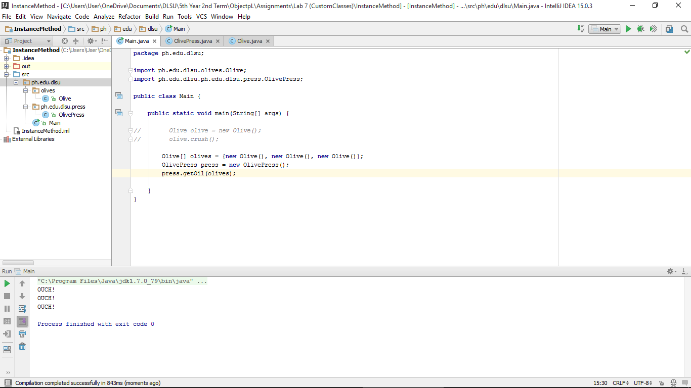
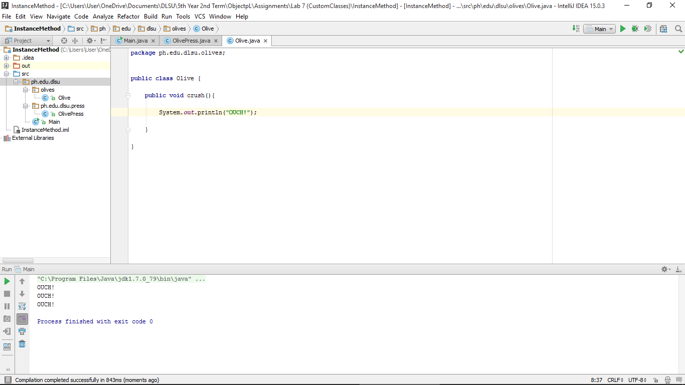
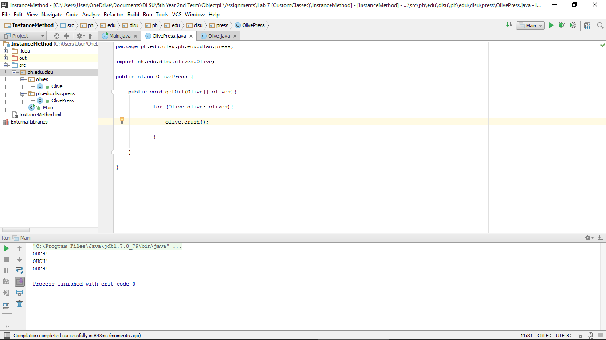

#InstanceMethod

#ScreenShots

###Main

###Olive

###OlivePress

#Codes

###Main

~~~
package ph.edu.dlsu;

import ph.edu.dlsu.olives.Olive;
import ph.edu.dlsu.ph.edu.dlsu.press.OlivePress;

public class Main {

    public static void main(String[] args) {

//        Olive olive = new Olive();
//        olive.crush();

        Olive[] olives = {new Olive(), new Olive(), new Olive()};
        OlivePress press = new OlivePress();
        press.getOil(olives);

    }
}
~~~

###Olive

~~~
package ph.edu.dlsu.olives;

public class Olive {

    public void crush(){

        System.out.println("OUCH!");

    }

}
~~~

###OlivePress

~~~
package ph.edu.dlsu.ph.edu.dlsu.press;

import ph.edu.dlsu.olives.Olive;

public class OlivePress {

    public void getOil(Olive[] olives){

            for (Olive olive: olives){

                olive.crush();

            }

    }

}
~~~
